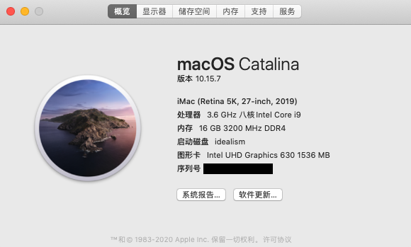
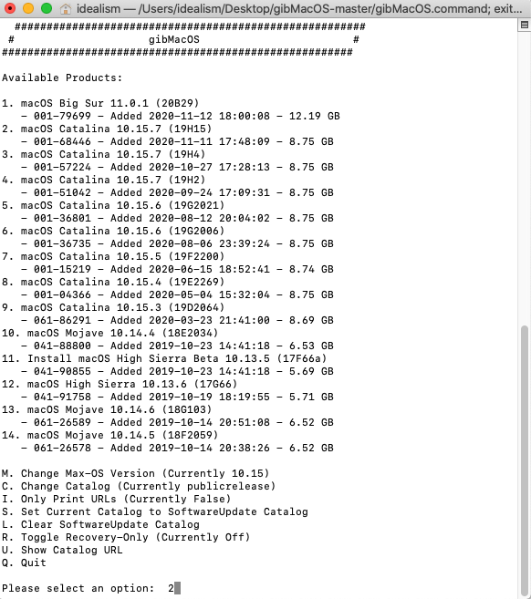
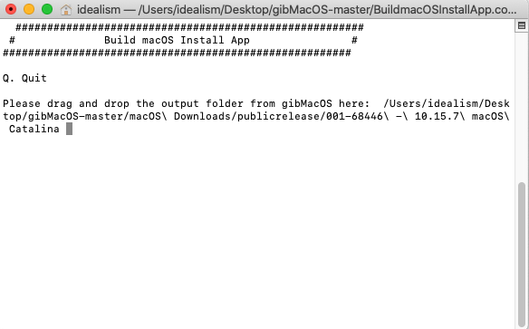
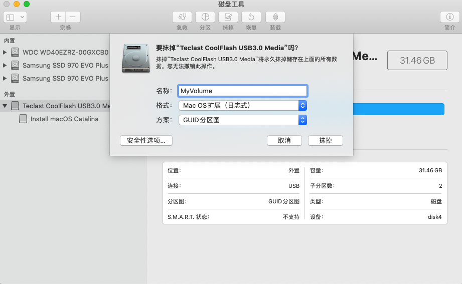
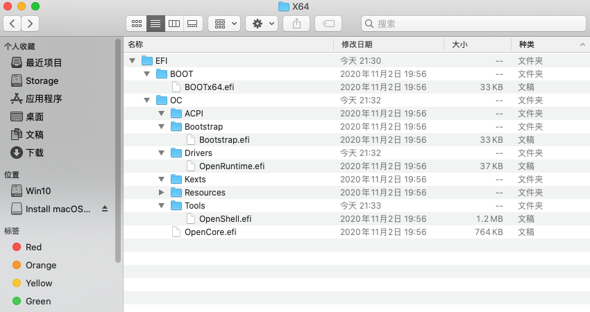
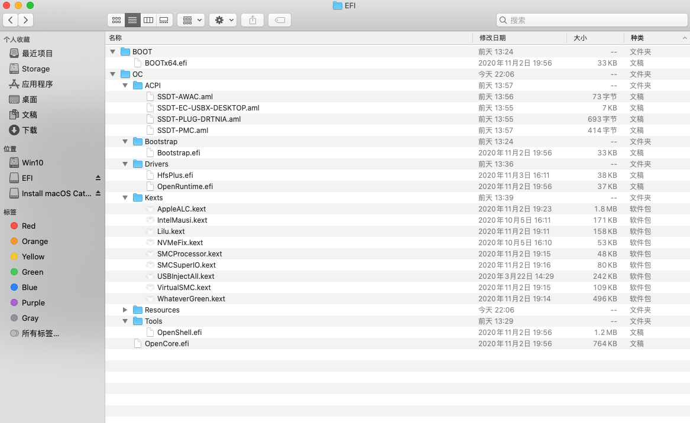
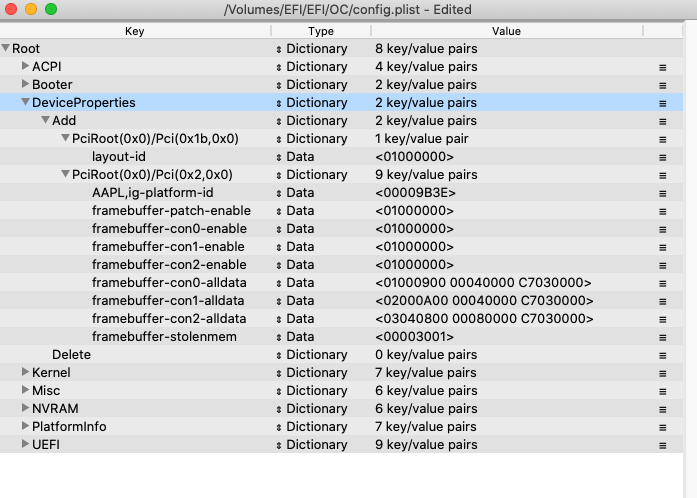
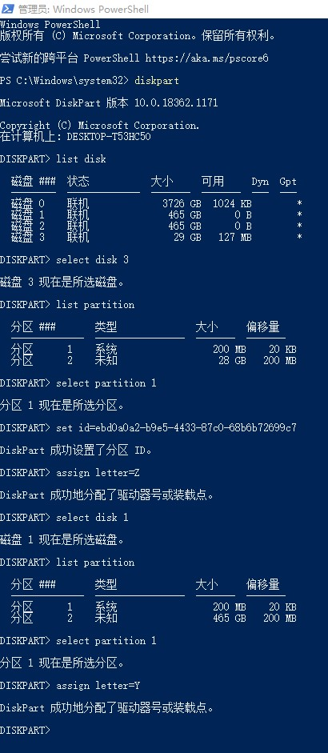
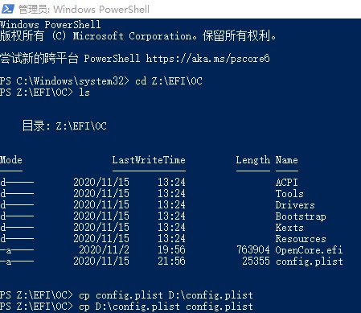

## Hackintosh


## 配置
|  |  |
| --- | --- |
| 主板 | [GIGABYTE Z390 AORUS PRO WIFI](https://item.jd.com/100000612305.html) |
| CPU | [i9-9900K](https://item.jd.com/100000634429.html) |
| iGPU | Intel UHD Graphics 630 |
| 独立显卡 | 无 |
| 内存 | [Kingston DDR4 3200 16GB](https://item.jd.com/100005089420.html) |
| 固态硬盘 | [Samsung SSD 970 EVO Plus](https://item.jd.com/100003181110.html) (Windows 10) |
| 固态硬盘 | [Samsung SSD 970 EVO Plus](https://item.jd.com/100003181110.html) (macOS Catelina 10.15.7) |
| 机械硬盘 | [Western Digital Blue 4TB](https://item.jd.com/2031266.html) |

## 背景
双系统 (Windows 10 + macOS Mojave 10.14.6) ，其中 macOS 使用 Clover 引导，使用一年多没有什么大问题，一直平稳运行（几乎从没有进过 Windows 10 ，除了偶尔几次玩游戏）。今年早些时候看到开始推荐 OpenCore ，看了网上的介绍就放弃了，由于还处于早期版本，并不推荐正常使用的同学安装。

最近 macOS 已经推出了 Big Sur 正式版，并且 Catalina 也应该是出了最后一个版本，已经很稳定了，网上也有了很丰富的 OpenCore 教程，所以准备升级一下。按照英文指南 [
OpenCore Install Guide (v0.6.3)](https://dortania.github.io/OpenCore-Install-Guide/) 流畅地配置了一遍，所有参数配置都直接按照指南配置（除了最后黑屏改了一下 `PciRoot(0x0)/Pci(0x2,0x0)` 下面的配置）。

## 准备工作

- 一个至少 16GB 的空 U 盘，用于制作启动盘
- 最好有一个 macOS 系统，方便后续处理各种事情
- 使用时间机器备份一下电脑数据，以便后续操作失败时能够恢复到正常状态
- 在无紧急事情且有完整的大段时间开始，推荐最迟中午开始，这样遇到一些问题时也能够在当前完成安装
- 耐心阅读英文指南 [
OpenCore Install Guide (v0.6.3)](https://dortania.github.io/OpenCore-Install-Guide/) ，尽量不要跳过一些说明，有些特殊情况没有着重表示（由于我是第一次配置，所以基本全部看了一遍，没有太多遗漏）

## [制作 USB 启动盘](https://dortania.github.io/OpenCore-Install-Guide/installer-guide/mac-install.html)

下载 [gibMacOS](https://github.com/corpnewt/gibMacOS) 项目，运行 `gibMacOS.command` （Windows 下可以运行 `gibMacOS.bat`），选择需要下载的版本，我选择了 `2` 。



等待下载完成后，需要先构建安装器（macOS 11+ 自动构建好了），运行 `BuildmacOSInstallApp.command` ，然后将刚刚下载的最内层文件夹拖入到终端内再回车。



构建完成后，在刚刚最内层文件夹内部会有一个新文件 `Install macOS Catalina` ，将其拖到左侧目录的“应用程序”文件夹中，方便后续操作。

插入 U 盘，打开“磁盘工具”，右键 U 盘（注意要选中外面这层）选择“抹掉...” ，然后填入名称，例如： `MyVolume` ，格式选择“Mac OS 扩展（日志式）”，方案选择“GUID 分区图”。



此时运行命令 `sudo /Applications/Install macOS Catalina.app/Contents/Resources/createinstallmedia --volume /Volumes/MyVolume` 制作启动盘。

完成后需要挂载 EFI 系统分区，可以使用 [MountEFI](https://github.com/corpnewt/MountEFI) 进行挂载，挂载完成后左侧目录“位置”下会出现一个名为 `EFI` 的卷宗，里面是空的，接下来需要安装 OpenCore 。

## [安装 OpenCore 并收集相关文件](https://dortania.github.io/OpenCore-Install-Guide/installer-guide/opencore-efi.html)

下载 [OpenCorePkg](https://github.com/acidanthera/OpenCorePkg/releases/)，推荐下载 `DEBUG` 版，方便后续调试排错，完成后可替换为 `RELEASE` 版。然后将其中 `X64` 文件夹内的 `EFI` 文件夹整体拷贝至前面挂载的 `EFI` 卷宗内。最后删除无用的文件，只保留截图内的文件即可（Resources 内不做处理）



接下来需要 [收集相关文件](https://dortania.github.io/OpenCore-Install-Guide/ktext.html) 了：

### Drivers （放在 `EFI/OC/Drivers/` 下）：

- [HfsPlus.efi](https://github.com/acidanthera/OcBinaryData/blob/master/Drivers/HfsPlus.efi)
- `OpenRuntime.efi`: 已有不需要再下载

### Kexts （放在 `EFI/OC/Kexts/` 下）：

- [AppleALC.kext](https://github.com/acidanthera/AppleALC/releases)
- [IntelMausi.kext](https://github.com/acidanthera/IntelMausi/releases)
- [Lilu.kext](https://github.com/acidanthera/Lilu/releases)
- [NVMeFix.kext](https://github.com/acidanthera/NVMeFix/releases)
- [USBInjectAll.kext](https://bitbucket.org/RehabMan/os-x-usb-inject-all/downloads/)
- [VirtualSMC](https://github.com/acidanthera/VirtualSMC/releases): 需要其中的 `SMCProcessor.kext`, `SMCSuperIO.kext` 和 `VirtualSMC.kext` 三个文件
- [WhateverGreen.kext](https://github.com/acidanthera/WhateverGreen/releases)

### SSDTs （放在 `EFI/OC/ACPI/` 下）：

**注**：以下四个文件我都直接使用了指南已经构建好的文件下载，比较方便，也可以按照对应的教程自己处理生成

- [SSDT-PLUG](https://dortania.github.io/Getting-Started-With-ACPI/Universal/plug.html): 直接下载 [SSDT-PLUG-DRTNIA.aml](https://github.com/dortania/Getting-Started-With-ACPI/blob/master/extra-files/compiled/SSDT-PLUG-DRTNIA.aml)
- [SSDT-EC-USBX](https://dortania.github.io/Getting-Started-With-ACPI/Universal/ec-fix.html): 直接下载 [SSDT-EC-USBX-DESKTOP.aml](https://github.com/dortania/Getting-Started-With-ACPI/blob/master/extra-files/compiled/SSDT-EC-USBX-DESKTOP.aml)
- [SSDT-AWAC](https://dortania.github.io/Getting-Started-With-ACPI/Universal/awac.html): 直接下载 [SSDT-AWAC.aml](https://github.com/dortania/Getting-Started-With-ACPI/blob/master/extra-files/compiled/SSDT-AWAC.aml)
- [SSDT-PMC](https://dortania.github.io/Getting-Started-With-ACPI/Universal/nvram.html): 直接下载 [SSDT-PMC.aml](https://github.com/dortania/Getting-Started-With-ACPI/blob/master/extra-files/compiled/SSDT-PMC.aml)

收集完相关文件后，目录树应该如下图所示：



## [配置 `config.plist`](https://dortania.github.io/OpenCore-Install-Guide/config.plist/)

首先在前面下载的 [OpenCorePkg](https://github.com/acidanthera/OpenCorePkg/releases/) 文件 `Docs/Sample.plist` 拷贝至 `EFI` 卷宗下的 `EFI/OC` 文件夹内，并重命名为 `config.plist` 。

然后下载 [ProperTree](https://github.com/corpnewt/ProperTree) 项目，用其打开 `config.plist` ，再按 `Cmd/Ctrl + Shift + R` 让软件根据我们前面所收集的文件自动生成合适的配置项

接下来需要根据我们的硬件[修改一些配置](https://dortania.github.io/OpenCore-Install-Guide/config.plist/coffee-lake.html)：

### `Root -> Booter -> Quirks`

需要将以下 5 个 `Key` 修改为对应的 `Value` ：

| Key | Value |
| --- | --- |
| DevirtualiseMmio | True |
| EnableWriteUnprotector | False |
| ProtectUefiServices | True |
| RebuildAppleMemoryMap | True |
| SyncRuntimePermissions | True |

### `Root -> DeviceProperties -> Add`

需要添加一个名为 `PciRoot(0x0)/Pci(0x2,0x0)` 的 `Dictionary` ，下面配置以下 9 个 `Data` 类型的字段：

| Key | Value |
| --- | --- |
| AAPL,ig-platform-id | 00009B3E |
| framebuffer-patch-enable | 01000000 |
| framebuffer-con0-enable | 01000000 |
| framebuffer-con1-enable | 01000000 |
| framebuffer-con2-enable | 01000000 |
| framebuffer-con0-alldata | 01000900 00040000 C7030000 |
| framebuffer-con1-alldata | 02000A00 00040000 C7030000 |
| framebuffer-con2-alldata | 03040800 00080000 C7030000 |
| framebuffer-patch-enable | 00003001 |



**注**：以上 9 个值并非最开始配置的，最开始按照指南配置，发现会黑屏（后来再看指南发现没有仔细看 [BusID iGPU patching](https://dortania.github.io/OpenCore-Post-Install/gpu-patching/intel-patching/)），最后找到了一个与我有类似情况人修改后的 [配置](https://github.com/timche/hackintosh-opencore-z390-aorus-pro)，使用了其中上面所列的 9 个字段

### `Root -> Kernel -> Quirks`

需要将以下 6 个 `Key` 修改为对应的 `Value` ：

| Key | Value |
| --- | --- |
| AppleXcpmCfgLock | True |
| DisableIOMapper | True |
| LapicKernelPanic | False |
| PanicNoKextDump | True |
| PowerTimeoutKernelPanic | True |
| XhciPortLimit | True |

### `Root -> Misc -> Debug`

需要将以下 4 个 `Key` 修改为对应的 `Value` ：

| Key | Value |
| --- | --- |
| AppleDebug | True |
| ApplePanic | True |
| DisableWatchDog | True |
| Target | 67 |

### `Root -> Misc -> Security`

需要将以下 5 个 `Key` 修改为对应的 `Value` ：

| Key | Value |
| --- | --- |
| AllowNvramReset | True |
| AllowSetDefault | True |
| ScanPolicy | 0 |
| SecureBootModel | Default |
| Vault | Optional |

### `Root -> NVRAM -> Add -> 7C436110-AB2A-4BBB-A880-FE41995C9F82`

需要将以下 1 个 `Key` 修改为对应的 `Value` ：

| Key | Value |
| --- | --- |
| boot-args | -v keepsyms=1 debug=0x100 alcid=11 igfxonln=1 |

 **注1**：`alcid=11` 在指南中为 `alcid=1`，均可也可正常使用（听说在 `11` 下跑得最好，玄学问题，也看不出来），所有可用值可在 [Supported codecs](https://github.com/acidanthera/applealc/wiki/supported-codecs) 找到，我们主板自带的声卡是 `Realtek ALC1220` ，找到对应的行，可以看到所有可用值为 `1, 2, 3, 5, 7, 11, 13, 15, 16, 21, 27, 28, 29, 34`

 **注2**：`igfxonln=1` 在指南中没有，这个属于 `Whatevergreen.kext` 的参数，用于[修复唤醒后 HDMI 显示器无信号的问题](https://www.reddit.com/r/hackintosh/comments/fw16mt/fix_for_10154_hdmi_wake_from_sleep/) 

 ### `Root -> NVRAM -> Delete`

需要将以下 1 个 `Key` 修改为对应的 `Value` ：

| Key | Value |
| --- | --- |
| WriteFlash | True |

### `Root -> PlatformInfo -> Generic`

在这里我们将设置 SMBIOS 信息，需要使用 [GenSMBIOS](https://github.com/corpnewt/GenSMBIOS) 这个工具生成一个。运行 `GenSMBIOS.command` 后，选择第三项 `3. Generate SMBIOS` ，然后输入 `iMac19,1` ，可以得到一个 SMBIOS 信息，将生成的 4 个值分别填入对应的位置即可。

- `Type` -> `SystemProductName`
- `Serial` -> `SystemSerialNumber`
- `Board Serial` -> `MLB`
- `SmUUID` -> `SystemUUID`

### `Root -> UEFI -> Quirks`

需要将以下 1 个 `Key` 修改为对应的 `Value` ：

| Key | Value |
| --- | --- |
| UnblockFsConnect | False |

至此我们已经处理完安装前所有的事情了，为了减少出错，可以使用 [Sanity Checker](https://opencore.slowgeek.com/) 校验我们刚刚配置完的 `config.plist` 。

## [设置 Bios](https://dortania.github.io/OpenCore-Install-Guide/config.plist/coffee-lake.html#intel-bios-settings)

安装前我们还需要先设置 BIOS ，指南中说明了需要更改的设置如下（由于部分设置需要最新版的固件，所以老版本的 BIOS 需要先[升级到 F12j](https://www.gigabyte.com/Motherboard/Z390-AORUS-PRO-WIFI-rev-10/support#support-dl-bios)）：

| 设置 | 值 | 所在位置 |
| --- | --- | --- |
| CFG Lock | Disable | `Boot -> CFG Lock` |
| Fast Boot | Disable | `Boot -> Fast Boot` |
| OS type | Windows 8.1/10 | `Boot -> Windows 8/10 Features` |
| CSM | Disable | `Boot -> CSM Support` |
| Secure Boot | Disable | `Boot -> Secure Boot -> Secure Boot Enable` |
| Hyper-Threading | Enable | `Tweaker -> Hyper-Threading Technology` |
| VT-d | Disable | `Tweaker -> Advanced CPU Settings -> VT-d` |
| Above 4G decoding | Enable | `Settings -> IO Ports -> Above 4G Decoding` |
| EHCI/XHCI Hand-off | Enable | `Settings -> IO Ports -> USB Configuration -> XHCI Hand-off` |
| DVMT Pre-Allocated(iGPU Memory) | 64MB | `Settings -> IO Ports -> DVMT Pre-Allocated` |
| SATA Mode | AHCI | `Settings -> IO Ports -> SATA And RST Configuration -> SATA Mode Selection` |
| Intel SGX | Disable | `Settings -> Miscellaneous -> Intel Platform Trust Technology (PTT)` |
| Intel Platform Trust | Disable | `Settings -> Miscellaneous -> Software Guard Extensions (SGX)` |
| Thunderbolt | Disable | 未找到 |
| VT-x | Enable | 未找到 |
| Execute Disable Bit | Enable | 未找到 |
| Serial/COM Port | Disable | 未找到 |
| Parallel Port | Disable | 未找到 |

## [安装](https://dortania.github.io/OpenCore-Install-Guide/installation/installation-process.html)

插上我们准备好的启动盘启动电脑，开机时需要按 `F12` 进入启动菜单（怕错过时机可以不停按），在这里可能会看到很多启动项，我们选择 `Install macOS Catalina (External)` 这一项进入即可，然后就会进入官方的安装流程，跟着引导说明一步步操作即可。

## 后续设置

我这里是升级系统，所以很快就完成了，数据和设置都还保留着。但由于以前是由 Clover 引导启动，所以 macOS 的系统 `EFI` 卷宗内的 `EFI` 文件夹还都是 Clover 的配置，拔掉 U 盘后就无法使用 OpenCore 引导启动，需要将其删除，然后替换为我们 U 盘系统 `EFI` 卷宗内的 `EFI` 文件夹。

## 番外：Windows 10 下读写 `EFI` 卷宗

安装后继续操作把 `config.list` 改坏了，当时没有另外一个 macOS 系统，所以就需要在 Windows 10 下处理进行修改。

首先以管理员身份打开 `PowerShell` ，并运行 `diskpart` ，然后运行以下命令挂载 `EFI` 卷宗：

```shell
# 查看当前所有磁盘
list disk
# 选中 USB
select disk 3
# 查看 USB 中所有分区
list partition
# 选中 USB 的 EFI 分区
select partition 1
# 设置分区类型 ID （由于 USB是可移动媒介，所以需要先修改分区类型 ID ，否则无法成功挂载）
set id=ebd0a0a2-b9e5-4433-87c0-68b6b72699c7
# 将 USB的 EFI 分区挂载到 Z 盘
assign letter=Z

# 选中 macOS 所在磁盘
select disk 3
# 查看其中所有分区
list partition
# 选中 macOS 所在磁盘的 EFI 分区
select partition 1
# 将 macOS 所在磁盘的 EFI 分区挂载到 Y 盘
assign letter=Y
```



这时便可以在 `PowerShell` 中读写刚刚挂载的 Y/Z 盘，但无法在文件系统中打开，为了方便我们可以运行 `cp config.plist D:\config.plist` 将 `config.plist` 拷贝到 D 盘根目录，然后用 [ProperTree](https://github.com/corpnewt/ProperTree) 打开进行修改，修改完成后，再运行 `cp D:\config.plist config.plist` 将其拷回 USB 。



同理我们可以在 Windows 10 下拷贝任何我们想要的文件到 USB 中，将其同步到 macOS 下。
